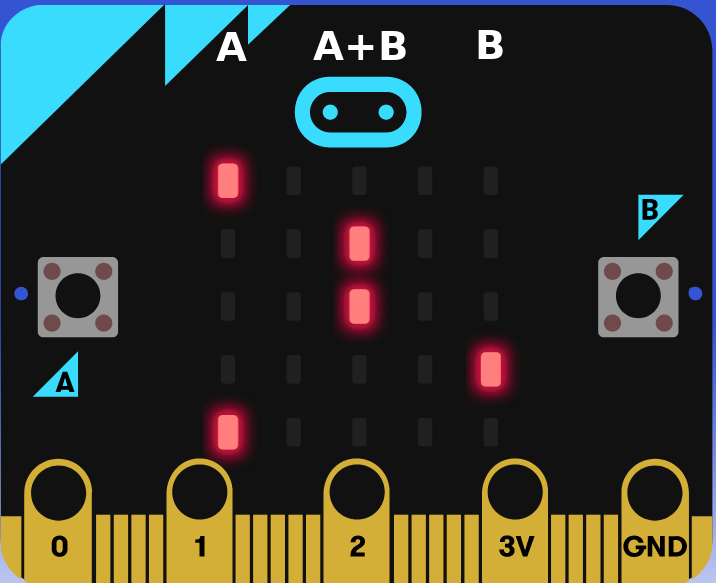

# Asteroid Destroyer

Asteroid Destroyer é um jogo feito para ser jogado em um [BBC Micro:bit](https://microbit.org/) e foi escrito na linguagem de programação [MicroPython](https://micropython.org/).

## Instruções do Jogo

#### Objetivo

Destrua todos os 100 asteroides o mais rápido possível. A pontuação é baseada no tempo (em segundos) em que o jogador levou para destrui todos os asteróides. 

#### Modo espera / menu

O jogo inicia carregando o modo espera (ou menu) que exibe um rosto feliz. Para começar a jogar precione ou o botão A (Fácil) ou B (Difícil).
    Botão A - para iniciar no modo fácil (toda tela será usada para mostrar os próximos asteroides)
    Botão B - para iniciar no modo Difícil (apenas o próximo asteroide é mostrado)

Depois que algum botão for precionado, o jogo e a contagem do tempo serão inicializados. No final do jogo será mostrado o tempo (em segundos) que o jogodor levou para destruir todos os asteroides, e voltará para o modo espera (rosto feliz).

#### Como jogar

Cada linha possui apenas um asteroide, e ele pode estar no lado esquerdo (1° Coluna) no centro (3° Coluna) ou na direta (5° Coluna), como é possível ver na imagem abaixo.

**Sempre destrua o asteroide que estiver na primeira linha**, as linhas abaixos são uma pré-visualização dos próximos asteroides que virão. 

Para destruir os asteroides que estão na primeira linha basta precionar:
	Botão A - Para destruir os asteroides na coluna esquerda
    Botão B - Para destruir os asteroides na coluna direita
    Botão A+B - Para destruir os asteroides na coluna central